# CommonsBooking — A Conceptual Map of UX Filters & Actions

> **Purpose.** This document is a *plan*, not code. It organizes the filter and
> action hooks that matter when a third party wants to **extend or customize the
> user experience (UX)** of CommonsBooking — the browsing, booking,
> notification and presentation surfaces a visitor, booking user or manager
> actually touches.
>
> It is built in four movements:
>
> 1. **Use cases** — a conceptual overview of *what* someone customizes.
> 2. **Use cases × domain objects** — the same use cases, re-read against the
>    domain model they act on.
> 3. **The place of the hooks** — the application layers, and where a filter or
>    action legitimately belongs in each.
> 4. **The hierarchy** — a single tree that lets you follow any use case
>    downward through the layers, from intent to hook.
>
> Throughout, hooks that **exist today** in the codebase are marked `✔`, and
> hooks that are **conceptual gaps** (natural extension points that are not yet
> emitted) are marked `◻`. The gap markers describe *where* a hook would belong
> in this scheme; they are proposals for discussion, not existing API.

---

## 0. Vocabulary & conventions

CommonsBooking already follows a loose naming grammar. To keep the map coherent,
this document treats that grammar as the intended convention:

| Pattern | Meaning | Example (existing) |
|---|---|---|
| `commonsbooking_<subject>_<aspect>` | filter that shapes a value | `commonsbooking_mail_subject` |
| `commonsbooking_before_<template>` / `_after_<template>` | action bracketing a rendered region | `commonsbooking_before_booking-single` |
| `commonsbooking_tag_{key}_{property}` | dynamic filter on a template-tag value | `commonsbooking_tag_item_title` |
| `commonsbooking_is<Role>` | filter overriding an access decision | `commonsbooking_isCurrentUserCBManager` |
| `commonsbooking_<verb>ed` / `_<verb>` | action announcing a lifecycle event | `commonsbooking_mail_sent` |

Two axes distinguish the two hook kinds throughout this document:

- **Filters** answer *"what should this value be?"* — they let an extension
  **reshape** data on its way to the screen or the mailbox.
- **Actions** answer *"something just happened / a region is about to render"* —
  they let an extension **inject** markup or **react** to an event.

---

## 1. Conceptual overview of the use cases

Before any object or layer, the question is: *what does a person actually try to
customize?* Seven UX use cases cover the surface area of the plugin.

### UC-1 — Discover & browse the commons
A visitor scans what is shareable: item lists, location lists, the interactive
map, and search. Customizers want to re-order, re-label, filter the set, and
enrich each card.

### UC-2 — Check availability & start a booking
A user opens an item or location, reads the availability calendar, and begins a
booking. Customizers want to influence how availability is computed and
rendered, how far the calendar reaches, and what surrounds the booking form.

### UC-3 — Move a booking through its lifecycle
A booking is created → (auto-)confirmed or held unconfirmed → possibly canceled;
a booking code is issued. Customizers want to hook the transitions and the
on-screen notices and codes that accompany them.

### UC-4 — Communicate with people
Confirmations, cancellations, reminders, code deliveries and iCal invites are
emailed. Customizers want to rewrite subjects, bodies, recipients and
attachments, and react after send.

### UC-5 — Present & theme content
Single pages, meta blocks, the calendar key, the user widget, and every
template tag render text and markup. Customizers want to swap templates, wrap
regions, and override individual field values.

### UC-6 — Govern access & roles
Who is an admin, a manager, a subscriber; which roles are "privileged." This
governs which UX affordances appear. Customizers want to redefine these
decisions.

### UC-7 — Integrate with the outside
REST endpoints, GBFS feeds, data export/erase, caching, and translation plugins
(WPML). Customizers want the data these surfaces expose to reflect their
overrides, consistently with the on-site UX.

```
        ┌──────────────────── The person at the centre ────────────────────┐
        │  visitor        booking user        manager        integrator     │
        └───────────────────────────────────────────────────────────────────┘
UC-1 Discover   UC-2 Availability   UC-3 Lifecycle   UC-4 Communicate
        UC-5 Present        UC-6 Govern access        UC-7 Integrate
```

---

## 2. The use cases, re-read against the domain objects

The same seven use cases, now anchored to the domain model actually implemented
in `src/Model` and registered as custom post types in
`src/Wordpress/CustomPostType`.

### 2.0 The domain objects in one glance

| Object | Role in the domain | Source |
|---|---|---|
| **Item** | The bookable good (cargo bike, tool). | `Model/Item`, CPT `cb_items` |
| **Location** | Where an item lives / is handed over. | `Model/Location`, CPT `cb_locations` |
| **Timeframe** | The central availability primitive — binds *item × location × period* and carries a type (bookable, holiday, repair). | `Model/Timeframe`, CPT `cb_timeframes` |
| **Booking** | A concrete reservation over a timeframe; states `unconfirmed / confirmed / canceled`. | `Model/Booking`, CPT `cb_bookings` |
| **BookingCode** | The code redeemed at handover. | `Model/BookingCode` |
| **Restriction** | A block that suspends bookability (e.g. broken item). | `Model/Restriction`, CPT `cb_restrictions` |
| **Calendar / Week / Day** | Rendering aggregates over timeframes/bookings. | `Model/{Calendar,Week,Day}` |
| **Map** | Spatial presentation of locations. | `Model/Map`, CPT `cb_map` |
| **Message / MessageRecipient** | An outbound notification and its addressees. | `Messages/*`, `Model/MessageRecipient` |
| **User (role)** | The actor and their capabilities. | `includes/Users.php` |

### 2.1 Use case ↦ primary domain objects

| Use case | Primary objects | Secondary objects |
|---|---|---|
| UC-1 Discover & browse | Item, Location, Map | Timeframe (badge "available now") |
| UC-2 Availability & book | Timeframe, Calendar/Day/Week | Item, Location, Restriction |
| UC-3 Lifecycle | Booking, BookingCode | Timeframe, User |
| UC-4 Communicate | Message, MessageRecipient | Booking, BookingCode, Location |
| UC-5 Present & theme | *(all, via template tags)* | Item, Location, Booking, Timeframe |
| UC-6 Govern access | User (role) | Booking (ownership) |
| UC-7 Integrate | Item, Location, Timeframe | Booking, Map, Message |

### 2.2 Reading the use cases through the objects

- **Item / Location** are the *nouns of discovery* (UC-1) and the *context of a
  booking* (UC-2). Customizing their cards, meta blocks and ordering is the most
  common UX request.
- **Timeframe** is the quiet hub: it is what the calendar is made of (UC-2),
  what a Restriction suspends, and what a Booking consumes. Any customization of
  "what is bookable, and how it reads" ultimately touches a Timeframe.
- **Booking** is the *verb made durable* (UC-3). Its state transitions are the
  spine that UC-4 (messaging) hangs off of.
- **Message** is downstream of Booking/BookingCode/Location events; it is where
  UC-4 lives entirely.
- **User/role** cuts across everything (UC-6): it decides which of the above a
  given person is even shown.

---

## 3. The place of the hooks — application layers

CommonsBooking is organized in five layers. A hook is only well-placed if it
lives in the layer that owns the decision it exposes. This section states, per
layer, *what belongs there* and *which existing/gap hooks sit there.*

### L1 — Data & persistence layer
`Wordpress/CustomPostType/*`, `Wordpress/PostStatus/*`, `Repository/*`, `Model/*`

Owns CPT registration, post-status registration, save/update wiring
(`save_post_cb_bookings`, `post_updated`), and queries. Hooks here shape
**what data exists and how it is fetched** — the raw material every UX surface
later renders.

| Hook | Kind | Status | What it governs |
|---|---|---|---|
| `commonsbooking_custom_metadata` | filter | ✔ | Extra CMB2 metadata registered on objects |
| `commonsbooking_booking_filter` | filter | ✔ | Which bookings a query returns |
| `commonsbooking_disableCache` | filter | ✔ | Whether the object/query cache is bypassed |
| `commonsbooking_saved_<object>` (item/location/timeframe/booking) | action | ◻ | React after a domain object is persisted |
| `commonsbooking_query_args_<object>` | filter | ◻ | Reshape repository query args before fetch |

### L2 — Domain & service layer
`Service/*` (Booking, BookingCodes, BookingRule, Holiday, iCalendar, Scheduler,
Cache), `Messages/*`

Owns business rules: availability computation, booking-rule validation, code
generation, scheduling, and message assembly. Hooks here shape **decisions and
outbound content** — the truth the UI will present, and the emails that leave
the system.

| Hook | Kind | Status | What it governs |
|---|---|---|---|
| `commonsbooking_mail_subject` | filter | ✔ | Email subject |
| `commonsbooking_mail_body` | filter | ✔ | Email body |
| `commonsbooking_mail_to` | filter | ✔ | Recipient address(es) |
| `commonsbooking_mail_attachment` | filter | ✔ | Attachments |
| `commonsbooking_mail_sent` | action | ✔ | React after a message is sent |
| `commonsbooking_before_send_location_reminder_mail` | filter | ✔ | Gate/shape location reminder mails |
| `commonsbooking_emailcodes_icalevent_title` | filter | ✔ | iCal event title in code mails |
| `commonsbooking_booking_state_changed` | action | ◻ | Single unified transition event (confirm/cancel/hold) |
| `commonsbooking_bookable_slots` | filter | ◻ | Adjust computed availability before render |
| `commonsbooking_booking_code` | filter | ◻ | Override generated code format |

### L3 — Presentation & view layer
`View/*`, `templates/*`, `CB/CB.php` (template tags), `includes/Template.php`,
`includes/TemplateParser.php`, shortcodes, `Wordpress/Widget/*`

Owns rendering: shortcodes (`cb_items`, `cb_locations`, `cb_map`, `cb_bookings`,
`cb_items_table`, `cb_search`, `cb`), template resolution, the calendar HTML,
single-page templates, and the `[cb ...]` template-tag system. This is where the
**bulk of UX customization** happens.

| Hook | Kind | Status | What it governs |
|---|---|---|---|
| `commonsbooking_get_template_part` | filter | ✔ | Swap which template file renders |
| `commonsbooking_template_tag` | filter | ✔ | Post-process a parsed template |
| `commonsbooking_tag_{key}_{property}` | filter | ✔ | Override any single template-tag value |
| `commonsbooking_mobile_calendar_month_count` | filter | ✔ | Calendar reach on mobile |
| `commonsbooking_widget_title` | filter | ✔ | User widget title |
| `commonsbooking_before_/after_item-single` | action | ✔ | Wrap the item page |
| `commonsbooking_before_/after_location-single` | action | ✔ | Wrap the location page |
| `commonsbooking_before_/after_booking-single` | action | ✔ | Wrap the booking page |
| `commonsbooking_before_/after_item-calendar-header` | action | ✔ | Wrap the item calendar header |
| `commonsbooking_before_/after_location-calendar-header` | action | ✔ | Wrap the location calendar header |
| `commonsbooking_before_/after_timeframe-calendar` | action | ✔ | Wrap the availability calendar |
| `commonsbooking_shortcode_atts_<tag>` | filter | ◻ | Normalize shortcode attributes |
| `commonsbooking_<listing>_query` / `_results` | filter | ◻ | Reorder/filter item & location listings and map markers |
| `commonsbooking_before_/after_shortcode-items` (and other list/table/map templates) | action | ◻ | Wrap listing regions not yet bracketed |
| `commonsbooking_calendar_day_classes` | filter | ◻ | Per-day CSS/state hints |

### L4 — Access & role layer
`includes/Users.php`

Owns the answer to "who is this person, and what may they see/do." Hooks here
shape **which UX affordances are exposed at all** (admin tools, manager actions,
subscriber-only views).

| Hook | Kind | Status | What it governs |
|---|---|---|---|
| `commonsbooking_isCurrentUserAdmin` | filter | ✔ | Admin determination |
| `commonsbooking_isCurrentUserCBManager` | filter | ✔ | Manager determination |
| `commonsbooking_isCurrentUserSubscriber` | filter | ✔ | Subscriber determination |
| `commonsbooking_admin_roles` | filter | ✔ | Roles counted as admin |
| `commonsbooking_manager_roles` | filter | ✔ | Roles counted as manager |
| `commonsbooking_privileged_roles` | filter | ✔ | Roles counted as privileged |
| `commonsbooking_can_book` | filter | ◻ | Per-user/per-item bookability gate |

### L5 — Integration & API layer
`API/*` (REST routes, GBFS), user data exporters/erasers, WPML bridges

Owns external representations. Hooks here keep the **outside view consistent**
with the customized on-site UX.

| Hook | Kind | Status | What it governs |
|---|---|---|---|
| *(WPML)* `wpml_switch_language_for_email` / `wpml_reset_language_after_mailing` | action | ✔ (external) | Per-recipient email language |
| `commonsbooking_api_item_response` / `_location_response` | filter | ◻ | Shape REST/GBFS payloads |
| `commonsbooking_api_availability` | filter | ◻ | Shape the availability route output |

---

## 4. The hierarchy — following a use case through the layers

This is the synthesis. Each use case is a path from **intent** down through the
layers to the concrete **hooks** that realize it. Read top-to-bottom to see how a
single customization goal descends through the application.

```
CommonsBooking UX extension surface
│
├── UC-1 · Discover & browse the commons
│    ├── L1 Data ....... commonsbooking_booking_filter ✔ · query_args_<object> ◻
│    ├── L3 Present ..... shortcodes cb_items / cb_locations / cb_map / cb_search
│    │                     ├─ commonsbooking_get_template_part ✔      (swap card template)
│    │                     ├─ commonsbooking_tag_{item|location}_* ✔  (relabel fields)
│    │                     ├─ commonsbooking_<listing>_query|_results ◻ (reorder/filter)
│    │                     └─ before/after shortcode-items|locations|map ◻ (wrap region)
│    └── L4 Access ...... commonsbooking_isCurrentUserSubscriber ✔    (who sees what)
│
├── UC-2 · Check availability & start a booking
│    ├── L2 Service ..... commonsbooking_bookable_slots ◻             (compute availability)
│    ├── L3 Present ..... timeframe-calendar template
│    │                     ├─ commonsbooking_before/after_timeframe-calendar ✔
│    │                     ├─ commonsbooking_before/after_item|location-calendar-header ✔
│    │                     ├─ commonsbooking_mobile_calendar_month_count ✔ (reach)
│    │                     └─ commonsbooking_calendar_day_classes ◻    (per-day state)
│    └── L4 Access ...... commonsbooking_can_book ◻                    (may this user book?)
│
├── UC-3 · Move a booking through its lifecycle
│    ├── L1 Data ........ save_post_cb_bookings / post_updated (WP core wiring)
│    │                     └─ commonsbooking_saved_booking ◻          (react to persist)
│    ├── L2 Service ..... commonsbooking_booking_state_changed ◻      (confirm/cancel/hold)
│    │                     └─ commonsbooking_booking_code ◻           (code format)
│    └── L3 Present ..... commonsbooking_before/after_booking-single ✔ (notice & code region)
│
├── UC-4 · Communicate with people
│    └── L2 Service ..... Messages/*
│                          ├─ commonsbooking_mail_subject ✔
│                          ├─ commonsbooking_mail_body ✔
│                          ├─ commonsbooking_mail_to ✔
│                          ├─ commonsbooking_mail_attachment ✔
│                          ├─ commonsbooking_before_send_location_reminder_mail ✔
│                          ├─ commonsbooking_emailcodes_icalevent_title ✔
│                          └─ commonsbooking_mail_sent ✔ (react)  ·  L5 wpml_* ✔ (language)
│
├── UC-5 · Present & theme content
│    └── L3 Present ..... template & tag system (cross-cuts UC-1..UC-3)
│                          ├─ commonsbooking_get_template_part ✔      (which file)
│                          ├─ commonsbooking_template_tag ✔           (parsed output)
│                          ├─ commonsbooking_tag_{key}_{property} ✔   (single value)
│                          ├─ commonsbooking_widget_title ✔
│                          └─ before/after {item|location|booking}-single ✔ (wrap pages)
│
├── UC-6 · Govern access & roles
│    └── L4 Access ...... includes/Users.php
│                          ├─ commonsbooking_isCurrentUser{Admin|CBManager|Subscriber} ✔
│                          └─ commonsbooking_{admin|manager|privileged}_roles ✔
│
└── UC-7 · Integrate with the outside
     ├── L1 Data ........ commonsbooking_disableCache ✔ · commonsbooking_custom_metadata ✔
     └── L5 Integration . commonsbooking_api_{item|location}_response ◻
                          └─ commonsbooking_api_availability ◻
```

### How to use this hierarchy

- **Extending an existing surface?** Find the use case, drop to the presentation
  layer (L3), and prefer a `before/after_<template>` action to inject, or a
  `tag_{key}_{property}` / `get_template_part` filter to reshape — no core edit
  needed.
- **Changing a decision, not a pixel?** Go higher: availability and messaging
  live in L2, "who may see/do" lives in L4, "what data exists" lives in L1.
- **Keeping an integration in sync?** Whatever you override in L1–L4, mirror it
  in L5 so the REST/GBFS/export views agree with the on-site UX.
- **Hitting a `◻` gap?** That marks a spot where this scheme says a hook
  *should* exist but the code does not yet emit one. Those are the natural
  candidates for the next round of extension-API work — proposals, not promises.

---

## 5. How the use cases and layers intertwine

The tree in §4 reads each use case *in isolation*. In practice the use cases are
not parallel lanes — they **share seams**. The value of a hook often comes
precisely from the fact that two use cases meet at it. The graphs below make the
overlaps explicit.

> The diagrams use Mermaid and render directly on GitHub and in most Markdown
> viewers.

### 5.1 The overlap graph — where use cases meet

Each rounded node is a **seam**: a shared concern that more than one use case
touches. When two use cases connect to the same seam, they *overlap there*. The
seam's label names the layer it lives in, so you can see the layers threading
through the overlaps.

```mermaid
flowchart TB
  classDef uc fill:#1f6feb,stroke:#0b3d91,color:#fff;
  classDef seam fill:#fff3cd,stroke:#b8860b,color:#5b4500;

  UC1["UC-1 · Discover &amp; browse"]:::uc
  UC2["UC-2 · Availability &amp; book"]:::uc
  UC3["UC-3 · Booking lifecycle"]:::uc
  UC4["UC-4 · Communicate"]:::uc
  UC5["UC-5 · Present &amp; theme"]:::uc
  UC6["UC-6 · Govern access"]:::uc
  UC7["UC-7 · Integrate"]:::uc

  TPL(["Template &amp; tag system · L3"]):::seam
  TF(["Timeframe hub · L1/L2"]):::seam
  STATE(["Booking-state seam · L1→L2"]):::seam
  ROLE(["Role gate · L4"]):::seam
  DATA(["Cache &amp; metadata · L1"]):::seam
  MSG(["Message &amp; language · L2/L5"]):::seam

  UC1 --- TPL
  UC2 --- TPL
  UC3 --- TPL
  UC5 --- TPL

  UC1 --- TF
  UC2 --- TF
  UC3 --- TF
  UC7 --- TF

  UC3 --- STATE
  UC4 --- STATE

  UC1 --- ROLE
  UC2 --- ROLE
  UC3 --- ROLE
  UC6 --- ROLE

  UC1 --- DATA
  UC2 --- DATA
  UC7 --- DATA

  UC4 --- MSG
  UC7 --- MSG
```



**How to read the overlaps.** Two use cases sharing a seam is the intertwining:

| Seam (shared concern) | Use cases that meet here | The overlap, in words |
|---|---|---|
| Template & tag system · L3 | UC-1, UC-2, UC-3, **UC-5** | UC-5 *is* the seam — every rendered surface (browse cards, calendar, booking notice) flows through `get_template_part` / `template_tag` / `tag_{key}_{property}`. |
| Timeframe hub · L1/L2 | UC-1, UC-2, UC-3, UC-7 | An "available now" badge (UC-1), the calendar (UC-2), a booking's slot (UC-3) and the API's availability (UC-7) are all *the same timeframe*, read differently. |
| Booking-state seam · L1→L2 | UC-3, UC-4 | The tightest seam: a state change (confirm/cancel/hold) is *simultaneously* a lifecycle event and the trigger for a message. |
| Role gate · L4 | UC-1, UC-2, UC-3, UC-6 | UC-6 is the cross-cut — the role check decides whether the discover view, the book action and the manage tools even appear. |
| Cache & metadata · L1 | UC-1, UC-2, UC-7 | Custom metadata added for display is the same field the listings, the calendar and the API all read. |
| Message & language · L2/L5 | UC-4, UC-7 | Email content (UC-4) and its per-recipient language / iCal (UC-7, WPML) are one pipeline. |

### 5.2 The convergent layered graph — threads meeting inside the layers

The same picture, turned on its side: use cases enter at the top and **thread
down through the layers**, converging on shared hook nodes. Where multiple
arrows arrive at one node, the use cases intertwine at that hook.

```mermaid
flowchart TB
  classDef uc fill:#1f6feb,stroke:#0b3d91,color:#fff;
  classDef node fill:#eef6ff,stroke:#4c8dff,color:#083b7a;

  UC1(UC-1):::uc
  UC2(UC-2):::uc
  UC3(UC-3):::uc
  UC4(UC-4):::uc
  UC5(UC-5):::uc
  UC6(UC-6):::uc
  UC7(UC-7):::uc

  subgraph L3[L3 · Presentation]
    TPL["template &amp; tag system"]:::node
    CAL["calendar + headers"]:::node
    SINGLE["before/after *-single"]:::node
  end
  subgraph L2[L2 · Service]
    SLOTS["bookable_slots ◻"]:::node
    STATE["booking_state_changed ◻"]:::node
    MAIL["mail_* hooks ✔"]:::node
  end
  subgraph L1[L1 · Data]
    QUERY["booking_filter / query ✔◻"]:::node
    CACHE["cache · custom_metadata ✔"]:::node
  end
  subgraph L4[L4 · Access]
    ROLE["role checks / can_book ✔◻"]:::node
  end
  subgraph L5[L5 · Integration]
    API["api responses ◻"]:::node
    LANG["email language ✔"]:::node
  end

  UC1 --> TPL & CAL & QUERY & CACHE & ROLE
  UC2 --> CAL & TPL & SLOTS & CACHE & ROLE
  UC3 --> SINGLE & TPL & STATE & QUERY & ROLE
  UC4 --> STATE & MAIL & LANG
  UC5 --> TPL & SINGLE
  UC6 --> ROLE
  UC7 --> QUERY & CACHE & SLOTS & API & LANG
```



Nodes with the most incoming arrows are the **load-bearing seams**: the template
& tag system (L3), the role gate (L4), and the booking-state / query pair
(L1↔L2). These are the places where a single hook customization ripples across
several use cases at once — powerful to hook, and the ones to touch most
carefully.

### 5.3 What the intertwining means for an extender

- **Hook a seam, move several use cases.** Overriding `tag_{key}_{property}` (L3)
  re-labels a field in the browse card *and* the booking page *and* the calendar
  header — because UC-1, UC-3 and UC-5 share that seam. One change, consistent
  everywhere.
- **Respect the tightest seam.** The booking-state → message seam (UC-3↔UC-4)
  means anything you do on cancellation is felt by the mailer. React on the
  *state* seam, not in two disconnected places.
- **Keep cross-cuts honest.** The role gate (UC-6) and the cache/metadata seam
  (UC-7) touch almost everything; a change there is never local. Verify it
  against every use case that shares the seam before shipping.

---

## Appendix A — Existing hooks, by layer (quick index)

**L1 Data:** `commonsbooking_custom_metadata`, `commonsbooking_booking_filter`,
`commonsbooking_disableCache`.

**L2 Service:** `commonsbooking_mail_subject`, `_mail_body`, `_mail_to`,
`_mail_attachment`, `commonsbooking_mail_sent`,
`commonsbooking_before_send_location_reminder_mail`,
`commonsbooking_emailcodes_icalevent_title`.

**L3 Present:** `commonsbooking_get_template_part`, `commonsbooking_template_tag`,
`commonsbooking_tag_{key}_{property}`,
`commonsbooking_mobile_calendar_month_count`, `commonsbooking_widget_title`,
and the `before_/after_` actions for `item-single`, `location-single`,
`booking-single`, `item-calendar-header`, `location-calendar-header`,
`timeframe-calendar`.

**L4 Access:** `commonsbooking_isCurrentUserAdmin`, `_isCurrentUserCBManager`,
`_isCurrentUserSubscriber`, `commonsbooking_admin_roles`, `_manager_roles`,
`_privileged_roles`.

**L5 Integration (external bridges):** `wpml_switch_language_for_email`,
`wpml_reset_language_after_mailing`, `cmb2_init`.

## Appendix B — Legend

- `✔` — hook is emitted in the current codebase (verified in `src/`,
  `templates/`, `includes/`).
- `◻` — conceptual gap: a natural extension point in this scheme that the code
  does not yet emit. Proposal for discussion, not existing API.
- **Filter** — reshapes a value (`apply_filters`).
- **Action** — announces an event or brackets a rendered region (`do_action`).
